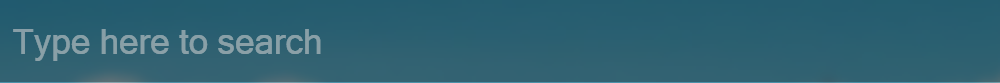

# Plugin

Introduce the plugin.

## Requirements

List here about the requirement.

If there are many requirements, you should add "more for [requirements.txt](requirements.txt).".

- Python3.x
- python-dotenv
- ...